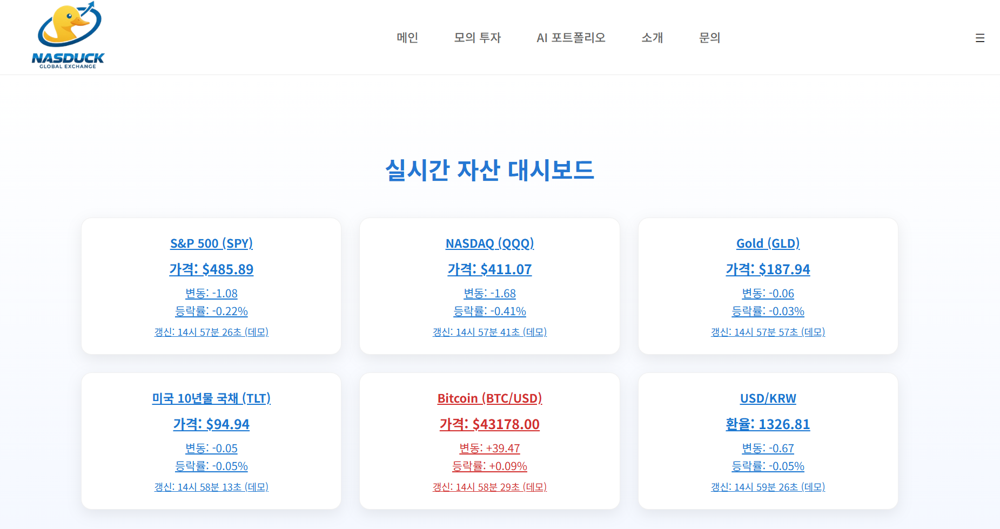
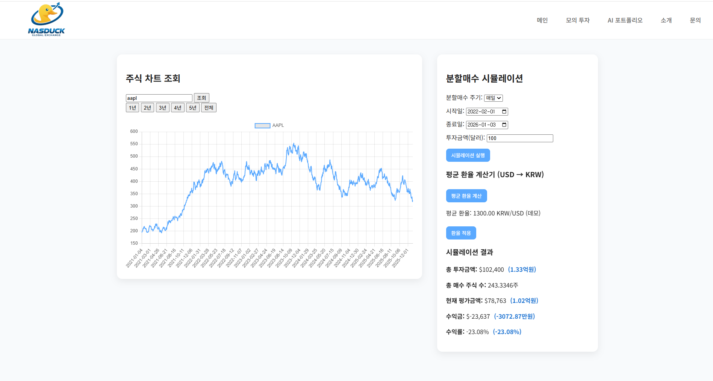
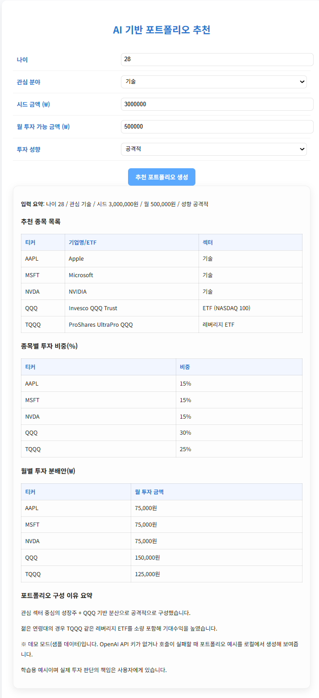

# NasDuck

주식/자산 대시보드, 분할매수 시뮬레이션, AI 포트폴리오 추천을 제공하는 학습용 웹 프로젝트입니다.

### Screenshots




## 핵심 기능
- 실시간 자산 대시보드: 주요 지수/금/채권/비트코인/환율 변동 표시
- 분할매수 시뮬레이션: 기간/주기별 매수 전략의 손익 계산
- AI 포트폴리오 추천: 입력 조건에 맞는 NASDAQ 종목/ETF 추천
- 인트로 애니메이션: 첫 진입 시 인터랙티브 효과 제공

## 페이지 구성
- 메인 대시보드: `index.html`, `index.js`
- 모의투자/시뮬레이션: `Chart.html`, `Chart.js`
- AI 포트폴리오: `AI Reco.html`, `AI Reco.js`
- 인트로 애니메이션: `starship.html`, `starship.js`, `starship.css`

## 기술 스택
- HTML / CSS / JavaScript
- jQuery
- Chart.js
- Alpha Vantage API (주가/환율)
- OpenAI API (AI 추천)

## 실행 방법
1. `index.html`을 브라우저로 열면 실행됩니다.
2. 차트/시뮬레이션/AI 추천은 외부 API 호출이 필요합니다.

## Alpha Vantage API 키 설정 (로컬 전용)
이 프로젝트는 보안을 위해 **API 키를 저장하지 않습니다.**

브라우저 콘솔에서 아래처럼 키를 저장하면 대시보드/차트/환율 기능이 동작합니다.
```
localStorage.setItem("ALPHAVANTAGE_API_KEY", "YOUR_ALPHA_VANTAGE_API_KEY");
```

## OpenAI API 키 설정 (로컬 전용)
이 프로젝트는 보안을 위해 **API 키를 저장하지 않습니다.**

브라우저 콘솔에서 아래처럼 키를 저장하면 AI 추천 기능이 동작합니다.
```
localStorage.setItem("OPENAI_API_KEY", "YOUR_OPENAI_API_KEY");
```

## 데모 모드(샘플 데이터)
- `index.html`: `ALPHAVANTAGE_API_KEY`가 없거나 호출이 실패하면 샘플 시세로 대시보드가 표시됩니다.
- `Chart.html`: `ALPHAVANTAGE_API_KEY`가 없거나 호출이 실패하면 샘플 시계열 데이터로 차트/시뮬레이션이 동작합니다.
- `AI Reco.html`: `OPENAI_API_KEY`가 없거나 호출이 실패하면 샘플 포트폴리오 결과를 로컬에서 생성해 표시합니다.
- 강제로 데모를 켜려면: `AI%20Reco.html?demo=1`

## 보안/배포 주의사항
- **API 키를 절대 저장하거나 커밋하지 마세요.**
- 공개 배포 시에는 프론트에서 직접 OpenAI API를 호출하지 말고, 서버/프록시를 통해 우회하세요.
- Alpha Vantage 무료 API는 호출 제한이 있어 트래픽이 많으면 실패할 수 있습니다.

## 데이터 출처
- Alpha Vantage (주가/환율)
- 외부 링크: 지수/금/채권/코인/환율 정보 제공 사이트

## 한계 및 개선 아이디어
- API 호출 제한/실패 대비 UX 개선 (에러 메시지, 캐시, 재시도)
- AI 추천은 프롬프트 기반이므로 결과의 일관성 보장 어려움
- 서버 프록시 도입 시 보안 및 신뢰성 향상 가능

## 포트폴리오 노트
학습/연구 목적의 프로젝트이며, 실제 투자 판단의 책임은 사용자에게 있습니다.
